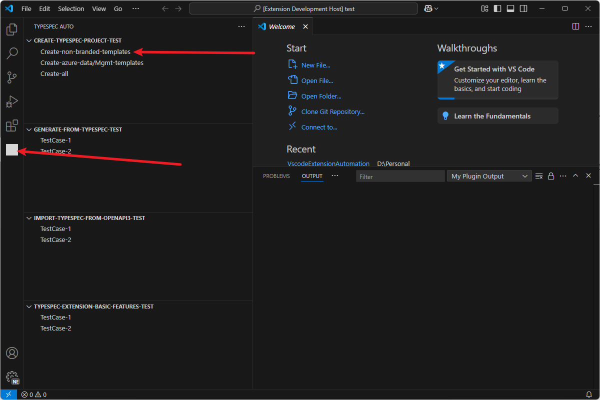

# TypeSpec Extension Automation

## Description

- This project is a vscode plug-in project based on JavaScript. It must be run by vscode. During the plug-in running process, **it must get the focus throughout the process, and the mouse also needs to be on the focused window**. Then the plug-in will automatically perform a series of automated operations and generate a log file.
- For information about manual testing, please refer to [here](https://github.com/xiaohua899/typespec/tree/patch-1/packages/typespec-vscode/test/manual).
- **If want to use the latest plugin, click [here](typespec-automation-1.0.0.vsix).** Then install it manually in `vscode`.

## Prerequisites

- [Nodejs V20](https://nodejs.org/en/download)
- Npm 7+
- [Visual Code](https://code.visualstudio.com/)
- [TypeSpec Compiler CLI](https://typespec.io/docs/): "npm install -g @typespec/compiler"
- [TypeSpec Vscode Extension](https://marketplace.visualstudio.com/items?itemName=typespec.typespec-vscode)
- [.NET 8.0 SDK](https://dotnet.microsoft.com/en-us/download)
- [Java 11](https://www.oracle.com/java/technologies/downloads/) or above, and [Maven](https://maven.apache.org/download.cgi)
- [Python 3.8+](https://www.python.org/downloads/)

## Quickstart

#### Project Structure

The project entry file is `extension.js`, which is the entry file of the entire project. Its main function is to register the plug-in and listen to the plug-in events. The core directory is `src`. There are five subfolders under the src directory, and their functions are as follows:

- `common`: Public module, including some utility functions
- `scripts`: Script module, contains some automation scripts
- `createTypespecProject`: New TypeSpec projects can be created using a variety of templates for specific purposes.
- `generateTypespecProject`: Different emitter types can be used to generate different codes to meet specific purposes.
- `importTypespecProject`: With the TypeSpec emitter for OpenAPI3, users can import a TypeSpec file from a designated OpenAPI3 document. While it is possible to repeatedly convert OpenAPI3 to TypeSpec.

#### This quickstart will show you how to use this tool to fetch all test data and run test cases locally.

1. Clone this repo and open it with Visual Studio.

   ```git
   git clone https://github.com/Yionse/VscodeExtensionAutomation.git
   ```

2. Install dependencies using `yarn`.

   ```
   npm i -g yarn
   yarn
   ```

3. Press `F5` to run the plugin and wait for the plugin to start a new vscode window.
4. In the new window, **first select an empty file as the root directory**, click the `tab` bar on the left and select `typespec auto`. Then click the required `item` to perform automated testing.
   

## Log

The current log is automatically generated. Each time the automation program is run, it will be automatically saved in the local `D:\typespecAutomationLogs`. To view the `log example`, click [here](./sampleLog.txt).

## Contributing

This project welcomes contributions and suggestions. Most contributions require you to agree to a Contributor License Agreement (CLA) declaring that you have the right to, and actually do, grant us the rights to use your contribution. For details, visit https://cla.microsoft.com.
